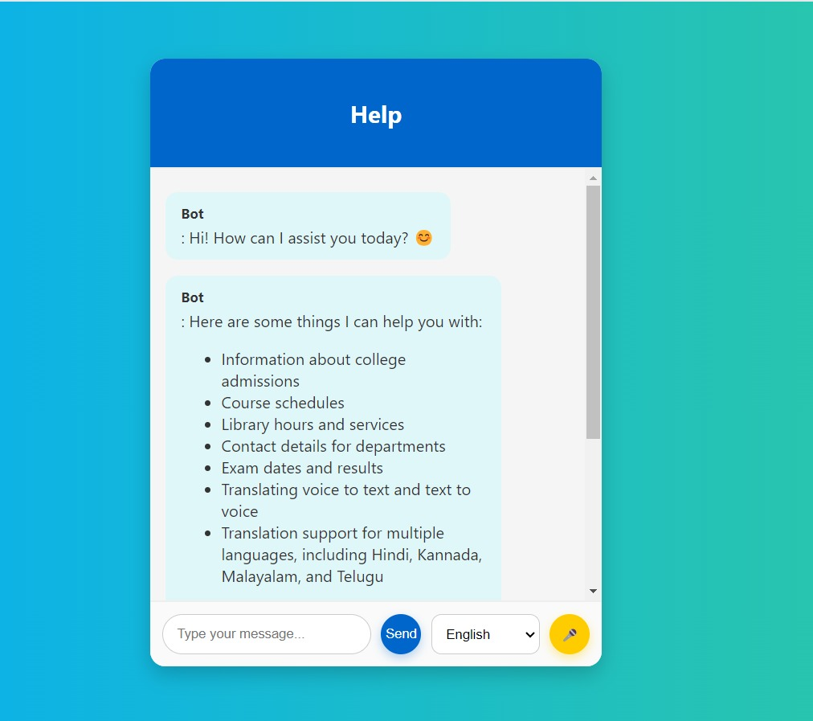

# 🌐 Live Translation Chatbot with Contextual Understanding

A voice-based chatbot built for educational institution websites that answers college-related queries — admissions, course schedules, library hours, department contacts, exam dates — in **5 Indian languages**: Hindi, English, Kannada, Malayalam, and Telugu.



---

## 🎯 Problem It Solves
Most college chatbots only support English, leaving out a large number of students and parents who are more comfortable communicating in their regional language. This creates a real accessibility gap in how educational institutions share information. This project bridges that gap by letting users speak in their preferred language and get accurate, context-aware responses back in that same language — without losing the thread of the conversation.

---

## 🚀 Features
- **Multilingual voice support** — Hindi, English, Kannada, Malayalam, Telugu
- **Voice-to-text and text-to-voice** conversion for a fully spoken interaction
- **Contextual understanding** — remembers earlier turns in the conversation instead of treating each query in isolation
- Handles queries about admissions, courses, library services, department contacts, and exam schedules
- Built to scale to other domains beyond education (e.g. customer care, healthcare)

---

## 🏗 Architecture
```
User → Voice Input → Speech-to-Text → Dialogflow (Intent + Context)
                                              ↓
                                          Database
                                              ↓
User ← Voice Output ← Text-to-Speech ← Dialogflow Response
```

---

## 🔧 Tools & Stack
- **Speech Recognition:** Kaldi
- **Text-to-Speech:** eSpeak
- **NLP:** Indic NLP Library, multilingual BERT and GPT models
- **Conversation Management:** Dialogflow
- **Real-Time Communication:** WebRTC
- **Database:** MongoDB
- **Datasets:** AI4Bharat

---

## 📚 Background
This was a Minor Project (M.Sc. Data Science, REVA University) built under the guidance of Dr. Radha N. It involved a full literature review of existing chatbot and speech-translation research, system architecture design, and dataset planning across five data categories: voice recognition data, translation data, conversational context data, NLU data, and NER data (for academic entities like course names and dates).

---

## 📍 Status
Architecture designed and core components implemented as part of academic coursework — voice input handling, multilingual NLU, contextual memory, and voice output.

## 🔗 Contact
📧 fernandesclancy17@gmail.com
💼 [linkedin.com/in/clancyfernandes](https://linkedin.com/in/clancyfernandes)
